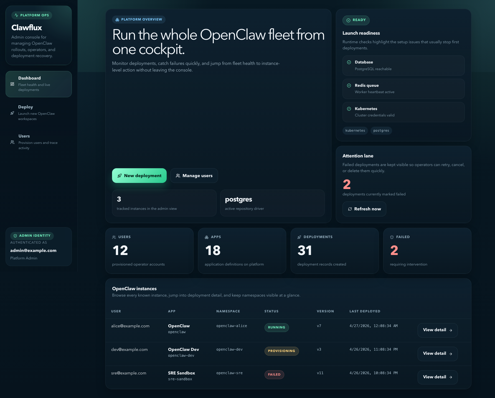
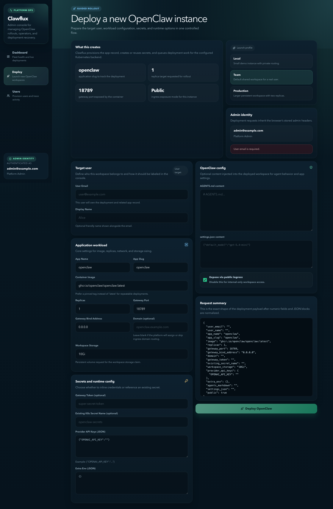
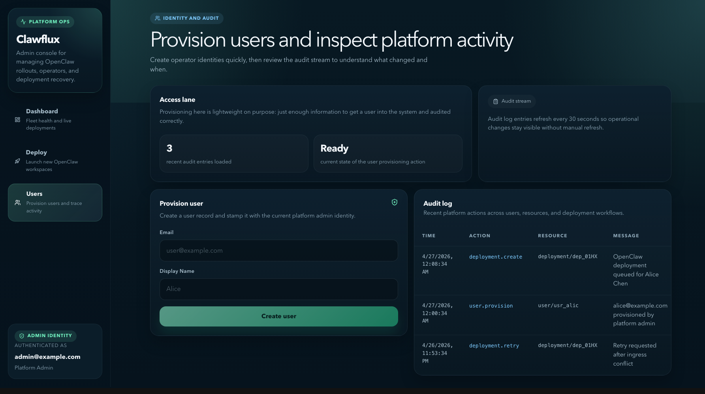

# Clawflux

> **The open-source control plane for deploying OpenClaw at scale.**

Clawflux is the missing backend between "I want to run OpenClaw for my users" and "I have a production-grade multi-tenant deployment system." It handles app lifecycle, async deployment orchestration, API auth, audit logging, and a React admin UI — so you can focus on building with OpenClaw instead of plumbing.

---

## Why Clawflux?

Most control planes are either too big (full PaaS, weeks to understand) or too small (a shell script that breaks at scale). Clawflux hits the sweet spot:

- **Purpose-built for OpenClaw** — not a generic container scheduler. It speaks OpenClaw's language natively: gateway tokens, workspace PVCs, provider API keys, AGENTS.md injection.
- **Small and hackable** — ~4k lines of Go, clean layer separation, easy to read and extend.
- **Production-ready architecture** — async workers, retries, deployment event history, audit logs, tenant isolation.
- **One command to run everything** — `make dev` starts the API, worker, and React UI together.

---

## What it does today

```
You → Admin UI → POST /v1/admin/openclaw/deploy
                       ↓
               Creates user + tenant
                       ↓
               Queues deployment job
                       ↓
               Worker picks it up
                       ↓
               Kubernetes: Namespace + Deployment + Service + Ingress
                           + PVC (workspace) + ConfigMap + Secret
                       ↓
               OpenClaw is running for that user ✓
```

Every deployment is tracked with status, events, and audit logs. Retry, cancel, or delete from the UI or API.

---

## Quick Start

**Prerequisites:** Go 1.22+, Docker, Node 18+

```bash
git clone https://github.com/gauravprasadgp/clawflux.git
cd clawflux
cp .env.example .env
go install github.com/swaggo/swag/cmd/swag@latest
make dev
```

That's it. Three things start:

| What | Where | Notes |
|---|---|---|
| API server | http://localhost:8080 | REST API + Swagger UI |
| React admin UI | http://localhost:5173 | Hot reload, proxied to API |
| Background worker | — | Processes deployment jobs async |

Open **http://localhost:5173** and set your admin email to get started.

### Try it via curl

**Create an API key:**
```bash
curl -X POST http://localhost:8080/v1/api-keys \
  -H 'Content-Type: application/json' \
  -H 'X-User-Email: alice@example.com' \
  -H 'X-User-Name: Alice' \
  -d '{"name":"local-cli"}'
```

**Deploy OpenClaw for a user (admin endpoint):**
```bash
curl -X POST http://localhost:8080/v1/admin/openclaw/deploy \
  -H 'Content-Type: application/json' \
  -H 'X-User-Email: admin@example.com' \
  -H 'X-Platform-Admin: true' \
  -d '{
    "user_email": "alice@example.com",
    "user_name": "Alice",
    "image": "ghcr.io/openclaw/openclaw:latest",
    "gateway_port": 18789,
    "workspace_storage": "10Gi",
    "provider_api_keys": {
      "OPENAI_API_KEY": "sk-..."
    },
    "public": true,
    "domain": "alice.yourclaw.io"
  }'
```

**Check deployment status:**
```bash
curl http://localhost:8080/v1/deployments/<deployment-id> \
  -H 'X-User-Email: alice@example.com'
```

Full API docs at **http://localhost:8080/swagger/**.

---

## Architecture

```
                         ┌──────────────────────┐
                         │   React Admin UI     │
                         │  (frontend/, :5173)  │
                         └──────────┬───────────┘
                                    │ HTTP
                         ┌──────────▼───────────┐
                         │      HTTP API        │
                         │   cmd/api + router   │
                         └──────────┬───────────┘
                                    │
        ┌──────────────┬────────────┼────────────┬──────────────┐
        │              │            │            │              │
   ┌────▼────┐   ┌─────▼─────┐ ┌───▼──────┐ ┌──▼──────┐ ┌────▼─────┐
   │  Auth   │   │    App    │ │  Deploy  │ │  Admin  │ │  Health  │
   │IAM+keys │   │  Service  │ │ Service  │ │  Audit  │ │Readiness │
   └────┬────┘   └─────┬─────┘ └───┬──────┘ └──┬──────┘ └────┬─────┘
        │              │           │            │              │
        └──────────────┴───────────┼────────────┴──────────────┘
                                   │
                        ┌──────────▼──────────┐
                        │    Repositories     │
                        │  Postgres | memory  │
                        └──────────┬──────────┘
                                   │
                        ┌──────────▼──────────┐
                        │  Scheduler Service  │
                        │  enqueue job intent │
                        └──────────┬──────────┘
                                   │
                        ┌──────────▼──────────┐
                        │   Redis Job Queue   │
                        └──────────┬──────────┘
                                   │
                        ┌──────────▼──────────┐
                        │  Worker (cmd/worker)│
                        └──────────┬──────────┘
                                   │
                        ┌──────────▼──────────┐
                        │  Deployment Backend │
                        │  Kubernetes adapter │
                        └─────────────────────┘
```

See [docs/architecture.md](docs/architecture.md) for the full breakdown.

### Repo layout

```
cmd/
  api/        → HTTP server entrypoint
  worker/     → Job queue consumer entrypoint
  migrate/    → Database migration runner
internal/
  api/http/   → Router, handlers, middleware, Swagger UI
  services/   → Business logic (app, deployment, auth, admin)
  domain/     → Types, interfaces, errors
  backends/
    kubernetes/ → K8s Deployment/Service/Ingress/PVC reconciliation
  repositories/
    postgres/   → PostgreSQL implementations
    memory/     → In-memory implementations (tests / no-DB dev)
  queue/redis/  → Minimal Redis RESP client for job queue
  worker/       → Consumer loop + job handlers
frontend/       → React + Vite admin UI
migrations/     → SQL migration files
docs/           → Architecture docs + Swagger output
```

---

## Admin UI

The React admin UI (http://localhost:5173 in dev) gives you a full control plane in the browser:

- **Dashboard** — live table of all deployed OpenClaw instances across all tenants, with status badges, namespace, and one-click drill-down
- **Instance detail** — deployment info, events log, Retry / Cancel / Delete
- **Deploy** — form to provision a user and deploy OpenClaw to Kubernetes in one click
- **Users** — provision users, view audit logs

The frontend is a standalone Vite + React app in `frontend/`. Contributors can work on it without touching Go:

```bash
cd frontend
npm install
npm run dev   # http://localhost:5173, proxied to :8080
```

### Screenshots

**Dashboard**



**Deploy OpenClaw**



**Users and audit log**



---

## Deployment Backends

Clawflux is backend-agnostic by design. The `domain.DeploymentBackend` interface has three methods: `Submit`, `Delete`, `GetStatus`. Swap the backend, keep everything else.

### Currently supported

| Backend | Status | Notes |
|---|---|---|
| **Kubernetes** | ✅ Production-ready | Namespace-per-tenant, Deployment + Service + Ingress + PVC + Secret |

### Roadmap

| Backend | Status | Notes |
|---|---|---|
| **Docker Compose** | 🔜 Planned | Single-machine deployments, great for self-hosters |
| **AWS ECS / Fargate** | 🔜 Planned | Serverless containers, no K8s required |
| **Fly.io** | 🔜 Planned | `flyctl` wrapper, fast global deploys |
| **Railway** | 🔜 Planned | Simple PaaS API integration |
| **DigitalOcean App Platform** | 🔜 Planned | Managed containers on DO |
| **Nomad** | 🔜 Planned | HashiCorp Nomad for teams already running it |
| **Bare metal / SSH** | 🔜 Planned | Deploy via SSH + systemd for the minimalists |

Want to add a backend? It's just one interface — see `internal/backends/kubernetes/backend.go` as the reference implementation.

---

## What's already built

- ✅ Multi-tenant app and deployment management
- ✅ Async worker pipeline with retries and sync jobs
- ✅ Kubernetes backend — full reconciliation (Deployment, Service, Ingress, PVC, ConfigMap, Secret)
- ✅ Namespace-per-tenant isolation with network policies
- ✅ OpenClaw-native config: gateway token, workspace PVC, provider API keys, AGENTS.md injection
- ✅ API key auth with prefix/hash storage
- ✅ Admin REST API + React control plane UI
- ✅ Deployment events, audit logs, health + readiness endpoints
- ✅ Swagger docs with live UI
- ✅ PostgreSQL + in-memory repositories (switchable)
- ✅ `make dev` — one command to start everything

---

## Roadmap

### Near-term
- [ ] **Real-time deployment logs** — stream pod logs through the API and into the UI
- [ ] **Dead-letter queue** — surface permanently failed jobs with alerting
- [ ] **Webhook notifications** — POST deployment status events to external systems
- [ ] **Docker Compose backend** — for single-machine or homelab deployments
- [ ] **Richer RBAC** — per-tenant roles, scoped API keys

### Medium-term
- [ ] **AWS ECS / Fargate backend**
- [ ] **Fly.io backend**
- [ ] **SSO / OAuth hardening** — production-ready auth beyond dev headers
- [ ] **Deployment diff view** — show what changed between deployments
- [ ] **Usage metrics** — CPU/memory per instance pulled from K8s metrics-server
- [ ] **Billing hooks** — pluggable usage events for hosted offerings

### Longer-term
- [ ] **Multi-cluster support** — deploy to different K8s clusters per region/tenant
- [ ] **GitOps mode** — trigger deployments from git push via webhook
- [ ] **Terraform provider** — manage Clawflux resources as infrastructure
- [ ] **CLI** — `clawflux deploy`, `clawflux status`, `clawflux logs`

---

## Contributing

Clawflux is early-stage and contributions are genuinely welcome. The codebase is small, the patterns are consistent, and there are plenty of well-scoped things to work on.

### Good first issues

| Area | What to do |
|---|---|
| **Tests** | Add unit tests for `services/` — currently only `internal/worker` is covered |
| **Docker Compose backend** | Implement `domain.DeploymentBackend` using `docker compose` |
| **Deployment log streaming** | Add `GET /v1/deployments/{id}/logs` that tails pod logs via K8s API |
| **Frontend polish** | Improve the React UI — dark mode polish, mobile layout, loading states |
| **Dead-letter queue** | Surface jobs that exceeded max attempts with a `GET /v1/admin/dead-letters` endpoint |
| **Webhook notifications** | `POST /v1/apps/{id}/webhooks` + fan-out on deployment status change |
| **Docs** | Architecture deep-dives, deployment guides, backend implementation walkthrough |

### How to contribute

1. Fork the repo and create a branch: `git checkout -b feat/your-feature`
2. Make your changes — keep Go style consistent (`go fmt`, `go vet`)
3. Add tests where it makes sense
4. Open a PR with a clear description of what and why

### Dev workflow

```bash
make dev          # start everything (API + worker + UI)
make test         # run tests
make lint         # format + vet + golangci-lint
make swag         # regenerate Swagger docs after changing annotations
```

Backend changes: edit Go files → server auto-restarts (or `make dev-api`).  
Frontend changes: edit `frontend/src/` → Vite hot-reloads instantly.

### Adding a new deployment backend

1. Create `internal/backends/<name>/backend.go`
2. Implement the `domain.DeploymentBackend` interface (3 methods: `Submit`, `Delete`, `GetStatus`)
3. Wire it up in `internal/app/bootstrap.go` behind a config flag
4. Add a row to the backends table in this README

See `internal/backends/kubernetes/backend.go` (~600 lines) as the reference.

---

## Community

- 🐛 [Issues](https://github.com/gauravprasadgp/Clawflux/issues)
- 💡 [Discussions](https://github.com/gauravprasadgp/Clawflux/discussions)

---

## License

MIT — see [LICENSE](LICENSE).

Built by @gauravprasadgp.
